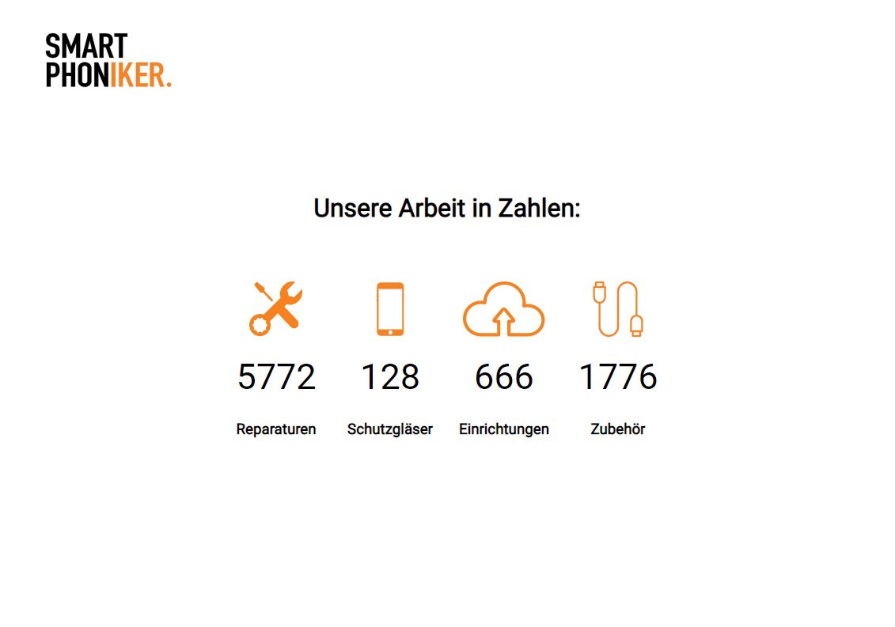

# A simple counter that shows stats about sold repairs and accessoires

The site fetches it's stats from a dedicated API endpoint of our ERP tool (also custom built). Therefore,
the data displayed is not some random quess. Rather, it shows actual numbers of sold stuff. The site is built to
be displayed on a 15,6" portable screen that is placed inside any of our shops.

